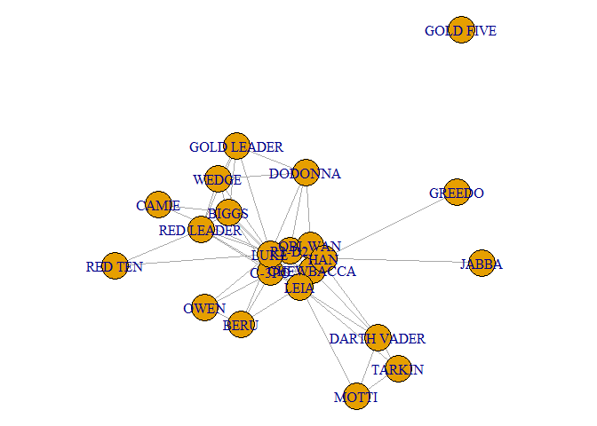
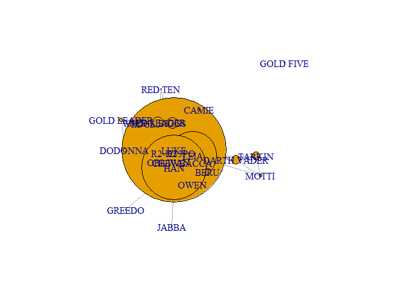
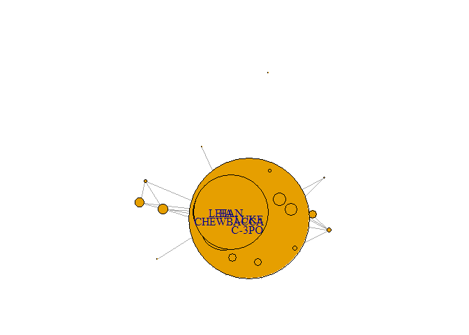
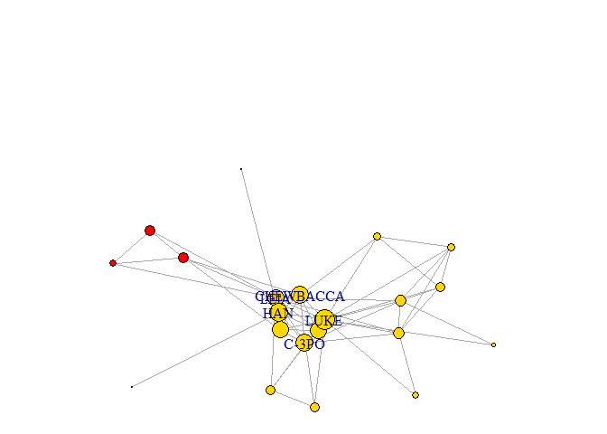
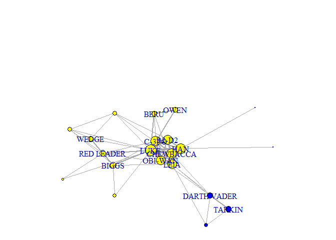
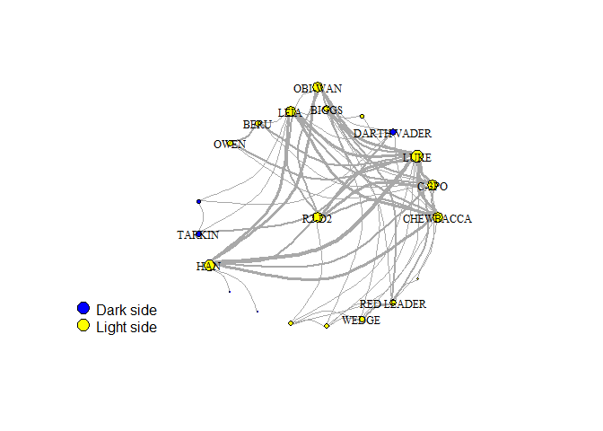

## Importing network data into R

In this section we will be using a small network that indicates [interactions in the movie Star Wars Episode IV](http://evelinag.com/blog/2015/12-15-star-wars-social-network/). Here, each node is a character and each edge indicates whether they appeared together in a scene of the movie. Edges here are thus _undirected_ and they also have weights attached, since they can appear in multiple scenes together.

The first step is to read the list of edges and nodes in this network:


```r
library(readr)
```

```
## Warning: package 'readr' was built under R version 3.5.3
```

```r
edges <- read_csv("data/edges.csv")
```

```
## Parsed with column specification:
## cols(
##   source = col_character(),
##   target = col_character(),
##   weight = col_double()
## )
```

```r
head(edges)
```

```
## # A tibble: 6 x 3
##   source    target weight
##   <chr>     <chr>   <dbl>
## 1 C-3PO     R2-D2      17
## 2 LUKE      R2-D2      13
## 3 OBI-WAN   R2-D2       6
## 4 LEIA      R2-D2       5
## 5 HAN       R2-D2       5
## 6 CHEWBACCA R2-D2       3
```

```r
nodes <- read_csv("data/nodes.csv")
```

```
## Parsed with column specification:
## cols(
##   name = col_character(),
##   id = col_double()
## )
```

```r
head(nodes)
```

```
## # A tibble: 6 x 2
##   name           id
##   <chr>       <dbl>
## 1 R2-D2           0
## 2 CHEWBACCA       1
## 3 C-3PO           2
## 4 LUKE            3
## 5 DARTH VADER     4
## 6 CAMIE           5
```

<!--For example, we learn that C-3PO and R2-D2 appeared in 17 scenes together.-->

How do we convert these two datasets into a network object in R? There are multiple packages to work with networks, but the most popular is `igraph` because it's very flexible and easy to do, and in my experience it's much faster and scales well to very large networks. Other packages that you may want to explore are `sna` and `networks`. We'll see an example later in this class, because some network modeling packages are not compatible with `igraph`.

Now, how do we create the igraph object? We can use the `graph_from_data_frame` function, which takes two arguments: `d`, the data frame with the edge list in the first two columns; and `vertices`, a data frame with node data with the node label in the first column. (Note that igraph calls the nodes `vertices`, but it's exactly the same thing.)


```r
#install.packages("igraph")
library(igraph)
```

```
## Warning: package 'igraph' was built under R version 3.5.3
```

```r
g <- graph_from_data_frame(d=edges, vertices=nodes, directed=FALSE)
g
```

```
## IGRAPH df573dd UNW- 22 60 -- 
## + attr: name (v/c), id (v/n), weight (e/n)
## + edges from df573dd (vertex names):
##  [1] R2-D2      --C-3PO       R2-D2      --LUKE       
##  [3] R2-D2      --OBI-WAN     R2-D2      --LEIA       
##  [5] R2-D2      --HAN         R2-D2      --CHEWBACCA  
##  [7] R2-D2      --DODONNA     CHEWBACCA  --OBI-WAN    
##  [9] CHEWBACCA  --C-3PO       CHEWBACCA  --LUKE       
## [11] CHEWBACCA  --HAN         CHEWBACCA  --LEIA       
## [13] CHEWBACCA  --DARTH VADER CHEWBACCA  --DODONNA    
## [15] LUKE       --CAMIE       CAMIE      --BIGGS      
## + ... omitted several edges
```

What does it mean?
- `U` means undirected  
- `N` means named graph  
- `W` means weighted graph  
- `22` is the number of nodes  
- `60` is the number of edges  
- `name (v/c)` means _name_ is a node attribute and it's a character  
- `weight (e/n)` means _weight_ is an edge attribute and it's numeric  

This is how you access specific elements within the igraph object:


```r
V(g) # nodes
```

```
## + 22/22 vertices, named, from df573dd:
##  [1] R2-D2       CHEWBACCA   C-3PO       LUKE        DARTH VADER
##  [6] CAMIE       BIGGS       LEIA        BERU        OWEN       
## [11] OBI-WAN     MOTTI       TARKIN      HAN         GREEDO     
## [16] JABBA       DODONNA     GOLD LEADER WEDGE       RED LEADER 
## [21] RED TEN     GOLD FIVE
```

```r
V(g)$name # names of each node
```

```
##  [1] "R2-D2"       "CHEWBACCA"   "C-3PO"       "LUKE"        "DARTH VADER"
##  [6] "CAMIE"       "BIGGS"       "LEIA"        "BERU"        "OWEN"       
## [11] "OBI-WAN"     "MOTTI"       "TARKIN"      "HAN"         "GREEDO"     
## [16] "JABBA"       "DODONNA"     "GOLD LEADER" "WEDGE"       "RED LEADER" 
## [21] "RED TEN"     "GOLD FIVE"
```

```r
vertex_attr(g) # all attributes of the nodes
```

```
## $name
##  [1] "R2-D2"       "CHEWBACCA"   "C-3PO"       "LUKE"        "DARTH VADER"
##  [6] "CAMIE"       "BIGGS"       "LEIA"        "BERU"        "OWEN"       
## [11] "OBI-WAN"     "MOTTI"       "TARKIN"      "HAN"         "GREEDO"     
## [16] "JABBA"       "DODONNA"     "GOLD LEADER" "WEDGE"       "RED LEADER" 
## [21] "RED TEN"     "GOLD FIVE"  
## 
## $id
##  [1]  0  1  2  3  4  5  6  7  8  9 10 11 12 13 14 15 16 17 18 19 20 21
```

```r
E(g) # edges
```

```
## + 60/60 edges from df573dd (vertex names):
##  [1] R2-D2      --C-3PO       R2-D2      --LUKE       
##  [3] R2-D2      --OBI-WAN     R2-D2      --LEIA       
##  [5] R2-D2      --HAN         R2-D2      --CHEWBACCA  
##  [7] R2-D2      --DODONNA     CHEWBACCA  --OBI-WAN    
##  [9] CHEWBACCA  --C-3PO       CHEWBACCA  --LUKE       
## [11] CHEWBACCA  --HAN         CHEWBACCA  --LEIA       
## [13] CHEWBACCA  --DARTH VADER CHEWBACCA  --DODONNA    
## [15] LUKE       --CAMIE       CAMIE      --BIGGS      
## [17] LUKE       --BIGGS       DARTH VADER--LEIA       
## [19] LUKE       --BERU        BERU       --OWEN       
## + ... omitted several edges
```

```r
E(g)$weight # weights for each edge
```

```
##  [1] 17 13  6  5  5  3  1  7  5 16 19 11  1  1  2  2  4  1  3  3  2  3 18
## [24]  2  6 17  1 19  6  1  2  1  7  9 26  1  1  6  1  1 13  1  1  1  1  1
## [47]  1  2  1  1  3  3  1  1  3  1  2  1  1  1
```

```r
edge_attr(g) # all attributes of the edges
```

```
## $weight
##  [1] 17 13  6  5  5  3  1  7  5 16 19 11  1  1  2  2  4  1  3  3  2  3 18
## [24]  2  6 17  1 19  6  1  2  1  7  9 26  1  1  6  1  1 13  1  1  1  1  1
## [47]  1  2  1  1  3  3  1  1  3  1  2  1  1  1
```

```r
g[] # adjacency matrix
```

```
## 22 x 22 sparse Matrix of class "dgCMatrix"
```

```
##    [[ suppressing 22 column names 'R2-D2', 'CHEWBACCA', 'C-3PO' ... ]]
```

```
##                                                               
## R2-D2        .  3 17 13 . . .  5 . .  6 . .  5 . . 1 . . . . .
## CHEWBACCA    3  .  5 16 1 . . 11 . .  7 . . 19 . . 1 . . . . .
## C-3PO       17  5  . 18 . . 1  6 2 2  6 . .  6 . . . . . 1 . .
## LUKE        13 16 18  . . 2 4 17 3 3 19 . . 26 . . 1 1 2 3 1 .
## DARTH VADER  .  1  .  . . . .  1 . .  1 1 7  . . . . . . . . .
## CAMIE        .  .  .  2 . . 2  . . .  . . .  . . . . . . . . .
## BIGGS        .  .  1  4 . 2 .  1 . .  . . .  . . . . 1 2 3 . .
## LEIA         5 11  6 17 1 . 1  . 1 .  1 1 1 13 . . . . . 1 . .
## BERU         .  .  2  3 . . .  1 . 3  . . .  . . . . . . . . .
## OWEN         .  .  2  3 . . .  . 3 .  . . .  . . . . . . . . .
## OBI-WAN      6  7  6 19 1 . .  1 . .  . . .  9 . . . . . . . .
## MOTTI        .  .  .  . 1 . .  1 . .  . . 2  . . . . . . . . .
## TARKIN       .  .  .  . 7 . .  1 . .  . 2 .  . . . . . . . . .
## HAN          5 19  6 26 . . . 13 . .  9 . .  . 1 1 . . . . . .
## GREEDO       .  .  .  . . . .  . . .  . . .  1 . . . . . . . .
## JABBA        .  .  .  . . . .  . . .  . . .  1 . . . . . . . .
## DODONNA      1  1  .  1 . . .  . . .  . . .  . . . . 1 1 . . .
## GOLD LEADER  .  .  .  1 . . 1  . . .  . . .  . . . 1 . 1 1 . .
## WEDGE        .  .  .  2 . . 2  . . .  . . .  . . . 1 1 . 3 . .
## RED LEADER   .  .  1  3 . . 3  1 . .  . . .  . . . . 1 3 . 1 .
## RED TEN      .  .  .  1 . . .  . . .  . . .  . . . . . . 1 . .
## GOLD FIVE    .  .  .  . . . .  . . .  . . .  . . . . . . . . .
```

```r
g[1,] # first row of adjacency matrix
```

```
##       R2-D2   CHEWBACCA       C-3PO        LUKE DARTH VADER       CAMIE 
##           0           3          17          13           0           0 
##       BIGGS        LEIA        BERU        OWEN     OBI-WAN       MOTTI 
##           0           5           0           0           6           0 
##      TARKIN         HAN      GREEDO       JABBA     DODONNA GOLD LEADER 
##           0           5           0           0           1           0 
##       WEDGE  RED LEADER     RED TEN   GOLD FIVE 
##           0           0           0           0
```

## Network visualization

How can we visualize this network? The `plot()` function works out of the box, but the default options are often not ideal:


```r
par(mar=c(0,0,0,0))
plot(g)
```

<!-- -->

Let's see how we can improve this figure. To see all the available plotting options, you can check `?igraph.plotting`. Let's start by fixing some of these.


```r
par(mar=c(0,0,0,0))
plot(g,
     vertex.color = "grey", # change color of nodes
     vertex.label.color = "black", # change color of labels
     vertex.label.cex = .75, # change size of labels to 75% of original size
     edge.curved=.25, # add a 25% curve to the edges
     edge.color="grey20") # change edge color to grey
```

<!-- -->

Now imagine that we want to modify some of these plotting attributes so that they are function of network properties. For example, a common adjustment is to change the size of the nodes and node labels so that they match their `importance` (we'll come back to how to measure that later). Here, `strength` will correspond to the number of scenes they appear in. And we're only going to show the labels of character that appear in 10 or more scenes.


```r
V(g)$size <- strength(g)
par(mar=c(0,0,0,0)); plot(g)
```

<!-- -->

```r
#Suppose we want label only on nodes with strength above 50
V(g)$label <- ifelse(strength(g)>50,V(g)$name,NA)   # Look up for syntax and use of ifelse in help page/internet
par(mar=c(0,0,0,0));plot(g)
```

<!-- -->

Aren't the plots messy (like some nodes ate up the others)? Why is it so? Can you modify `V(g)$size` so that each node strength is reflected in the plot without making it messy?

## Your Turn 1

```r
V(g)$size <- 2*log(strength(g))+1  ##Experiment with the constants and the function to get nice plot
par(mar=c(0,0,0,0)); plot(g)
```

<!-- -->

Did that work? If not, try some other function.

## Adding colors

We can also change the colors of each node based on what side they're in (dark side or light side).


```r
# create vectors with characters in each side
dark_side <- c("DARTH VADER", "MOTTI", "TARKIN")
light_side <- c("R2-D2", "CHEWBACCA", "C-3PO", "LUKE", "CAMIE", "BIGGS",
                "LEIA", "BERU", "OWEN", "OBI-WAN", "HAN", "DODONNA",
                "GOLD LEADER", "WEDGE", "RED LEADER", "RED TEN", "GOLD FIVE")
other <- c("GREEDO", "JABBA")
# node we'll create a new color variable as a node property
V(g)$color <- NA
V(g)$color[V(g)$name %in% dark_side] <- "red"
V(g)$color[V(g)$name %in% light_side] <- "gold"
V(g)$color[V(g)$name %in% other] <- "grey20"
vertex_attr(g)
```

```
## $name
##  [1] "R2-D2"       "CHEWBACCA"   "C-3PO"       "LUKE"        "DARTH VADER"
##  [6] "CAMIE"       "BIGGS"       "LEIA"        "BERU"        "OWEN"       
## [11] "OBI-WAN"     "MOTTI"       "TARKIN"      "HAN"         "GREEDO"     
## [16] "JABBA"       "DODONNA"     "GOLD LEADER" "WEDGE"       "RED LEADER" 
## [21] "RED TEN"     "GOLD FIVE"  
## 
## $id
##  [1]  0  1  2  3  4  5  6  7  8  9 10 11 12 13 14 15 16 17 18 19 20 21
## 
## $size
##  [1]  8.824046  9.286269  9.317766 10.719625  5.795791  3.772589  6.278115
##  [8]  9.155075  5.394449  5.158883  8.783641  3.772589  5.605170  9.764053
## [15]  1.000000  1.000000  4.218876  4.218876  5.394449  6.129899  2.386294
## [22]      -Inf
## 
## $label
##  [1] NA          "CHEWBACCA" "C-3PO"     "LUKE"      NA         
##  [6] NA          NA          "LEIA"      NA          NA         
## [11] NA          NA          NA          "HAN"       NA         
## [16] NA          NA          NA          NA          NA         
## [21] NA          NA         
## 
## $color
##  [1] "gold"   "gold"   "gold"   "gold"   "red"    "gold"   "gold"  
##  [8] "gold"   "gold"   "gold"   "gold"   "red"    "red"    "gold"  
## [15] "grey20" "grey20" "gold"   "gold"   "gold"   "gold"   "gold"  
## [22] "gold"
```

```r
par(mar=c(0,0,0,0)); plot(g)
```

<!-- -->

```r
# what does %in% do?
1 %in% c(1,2,3,4)
```

```
## [1] TRUE
```

```r
1 %in% c(2,3,4)
```

```
## [1] FALSE
```

If we want to indicate what the colors correspond to, we can add a legend.

```r
par(mar=c(0,0,0,0)); plot(g)
legend(x=.75, y=.75, legend=c("Dark side", "Light side", "Other"), 
       pch=21, pt.bg=c("red", "gold", "grey20"), pt.cex=2, bty="n") #What does everything inside legend() mean?
```

<!-- -->

## Your Turn 2
Include other in the dark side. Create a 'not messy' plot with the following features:

* nodes are blue for dark side and yellow for light side,
* legend on bottom left corner
* labels only on nodes with function(strength(g))> some threshold. Use the same function you used in __Your Turn 1__ and some threshold for which Darth Vader gets a label,
* edges are curved,
* labels are small yet legible


```r
dark_side=c(dark_side,other)
V(g)$color[V(g)$name %in% dark_side]="blue"
V(g)$color[V(g)$name %in% light_side]="yellow"
V(g)$label=NA
V(g)$label=ifelse(2*log(strength(g))+1>5,V(g)$name,NA)
par(mar=c(0,0,0,0))
plot(g,edge.curved=0.5, vertex.label.cex=0.75,vertex.label.color="black")
legend("bottomleft",legend=c("Dark side", "Light side"),pch=21,pt.bg=c("blue","yellow"),pt.cex=2,bty="n")
```

<!-- -->


## Edge Properties

Edge properties can also be modified. For example, here the width of each edge is taken to be a function of the log number of scenes those two characters appear together.

```r
E(g)$width <- log(E(g)$weight) + 1      # Why +1 ???
edge_attr(g)
```

```
## $weight
##  [1] 17 13  6  5  5  3  1  7  5 16 19 11  1  1  2  2  4  1  3  3  2  3 18
## [24]  2  6 17  1 19  6  1  2  1  7  9 26  1  1  6  1  1 13  1  1  1  1  1
## [47]  1  2  1  1  3  3  1  1  3  1  2  1  1  1
## 
## $width
##  [1] 3.833213 3.564949 2.791759 2.609438 2.609438 2.098612 1.000000
##  [8] 2.945910 2.609438 3.772589 3.944439 3.397895 1.000000 1.000000
## [15] 1.693147 1.693147 2.386294 1.000000 2.098612 2.098612 1.693147
## [22] 2.098612 3.890372 1.693147 2.791759 3.833213 1.000000 3.944439
## [29] 2.791759 1.000000 1.693147 1.000000 2.945910 3.197225 4.258097
## [36] 1.000000 1.000000 2.791759 1.000000 1.000000 3.564949 1.000000
## [43] 1.000000 1.000000 1.000000 1.000000 1.000000 1.693147 1.000000
## [50] 1.000000 2.098612 2.098612 1.000000 1.000000 2.098612 1.000000
## [57] 1.693147 1.000000 1.000000 1.000000
```

```r
par(mar=c(0,0,0,0)); plot(g)
```

<!-- -->

Up to now, everytime we run the `plot` function, the nodes appear to be in a different location. Why? Because it's running a probabilistic function trying to locate them in the optimal way possible.

## Layout

However, we can also specify the __layout__ for the plot; that is, the (x,y) coordinates where each node will be placed. `igraph` has a few different layouts built-in, that will use different algorithms to find an `optimal` distribution of nodes. The following code illustrates some of these:


```r
par(mfrow=c(2, 3), mar=c(0,0,1,0))
plot(g, layout=layout_randomly, main="Random")
plot(g, layout=layout_in_circle, main="Circle")
plot(g, layout=layout_as_star, main="Star")
plot(g, layout=layout_as_tree, main="Tree")
plot(g, layout=layout_on_grid, main="Grid")
plot(g, layout=layout_with_fr, main="Force-directed")
```

<!-- -->

Note that each of these is actually just a matrix of (x,y) locations for each node.


```r
l <- layout_randomly(g)
l
```

```
##             [,1]         [,2]
##  [1,] -0.7867559  0.096800022
##  [2,]  0.7697323 -0.533008953
##  [3,] -0.7161762  0.576122102
##  [4,] -0.4071598 -0.870609174
##  [5,]  0.8796456  0.674506520
##  [6,] -0.7731347 -0.513552753
##  [7,] -0.1796701 -0.659517412
##  [8,]  0.5497924 -0.924536062
##  [9,]  0.2873572 -0.548726938
## [10,] -0.7756648  0.321821246
## [11,] -0.3860550 -0.705824453
## [12,]  0.6384980  0.691123676
## [13,]  0.7653590  0.087443242
## [14,]  0.5935335  0.188160472
## [15,]  0.6615119  0.807194545
## [16,]  0.4001251 -0.472632102
## [17,] -0.2149512  0.717546199
## [18,] -0.1603612  0.131759295
## [19,] -0.4797933 -0.094425386
## [20,] -0.1751437  0.460235406
## [21,]  0.1803766  0.163321928
## [22,]  0.4490212  0.004916331
```

## Your Turn 3
modify the plot that you created in __Your Turn 2__ to incorporate the following features:

* edges are properly weighted,
* has a clean (low number of overlapping edges) layout (use any layout of your choice except tree) with OBI-WAN at the top center of the plot (HINT: Try to manipulate the coordinates for OBI-WAN manually),
* add an appropriate title (how do you do that in `plot()`? )

```r
E(g)$width <- log(E(g)$weight) + 1
l <- layout_as_star(g)
l[V(g)$name=="OBI-WAN"]=c(mean(l[,1]),max(l[,2]+0.2))
plot(g,edge.curved=0.5,layout=l, vertex.label.cex=0.75,vertex.label.color="black")
legend("bottomleft",legend=c("Dark side", "Light side"),pch=21,pt.bg=c("blue","yellow"),pt.cex=2,bty="n")
```

<!-- -->


